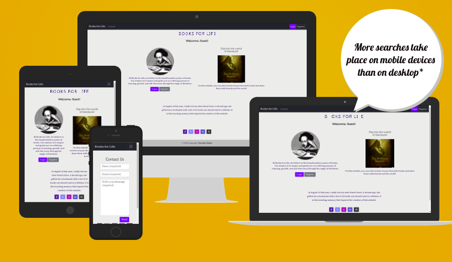
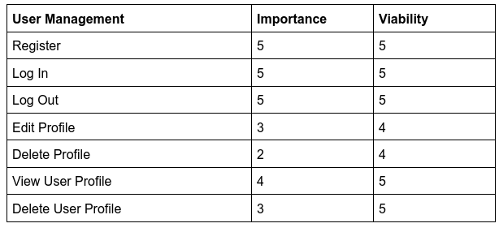
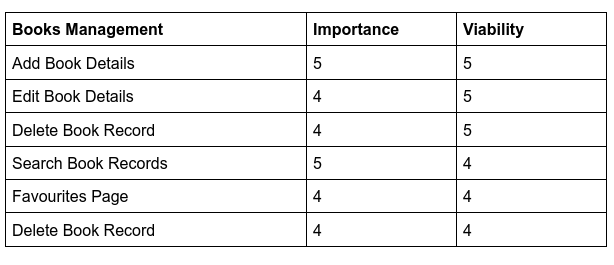
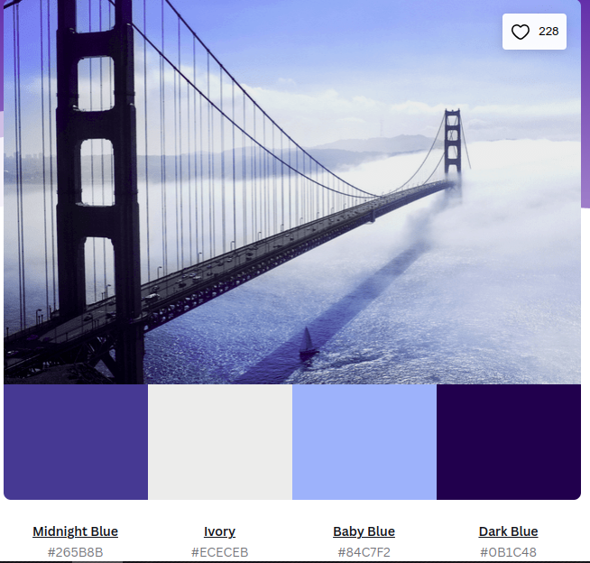
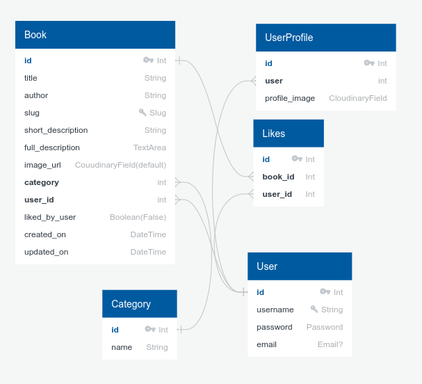

# Books for Life

## Table of Contents

[Books4Life](#books4life)
  * [Table of Contents](#table-of-contents)
  * [Introduction](#introduction)
  * [User Stories](#user-stories)
  * [UX](#ux)
    + [Typography](#typography)
    + [Wireframes](#wireframes)
  * [Accessibility](#accessibility)
  * [Database Design](#database-design)
  * [Features](#features)
  * [Existing Features](#existing-features)
    + [Custom Error Page](#custom-error-page)
    + [Favicon](#favicon)
    + [Future Features](#features-features)
  * [Issues and Bugs](#issues-and-bugs)
  * [Technologies Used](#technologies-used)
  * [Testing](#testing)
    + [Testing User Stories](#testing-user-stories)
    + [Manual Testing](#manual-testing)
    + [Automated Testing](#automated-testing) 
        - [Code Validation](#code-validation)
        - [Browser Validation](#browser-validation)
        - [Lighthouse Validation](#lighthouse-validation)
    + [User Testing](#user-testing)
  * [Deployment](#deployment)
    + [Local Deployment](#local-deployment)
    + [Heroku Deployment](#heroku-deployment)
  * [Credits](#credits)
    + [Content](#content)
    + [Media](#media)
  * [Acknowledgements](#acknowledgements)

## User Stories

1. As a new user, I want to be able to register for an account on the "Books for Life" website so that I can log in with a username and password.

2. As a registered user, I want to be able to edit my profile information, including my password, and profile picture.

3. As a registered user, I want the option to delete my user profile if I decide to leave the website.

4. As a registered user, I want to add a new book to the website, including its title, author, image, short description, and full description.

5. As a registered user, I want to be able to update the information (title, author, image, descriptions) of the books I've added.

6. As a registered user, I want to be able to delete book details from my profile, so it will no longer be visible.

7. As a registered user, I want to be able to like a book presentation so that I can keep track of my favourite books.

8. As a registered user, I want to see a list of all the books I've added to the website for easy reference.

9. As a bibliophile and a registered user, I want to browse and discover new books added by other users on the platform.

10. As a registered or new (unregistered) user, I want to be able to use a contact form to reach out to the website administrators with questions, feedback, or concerns.

## UX

### Development Planes

#### Strategy
- **Objective:** Create a user-centric site that encourages users to share and explore book recommendations, fostering a sense of community among book enthusiasts.
- **User Research:** Conduct surveys and user interviews to understand the needs, preferences, and pain points of both new and experienced book lovers.
- **Competitor Analysis:** Analyse similar platforms to identify gaps and opportunities in the market.
- **Persona Creation:** Develop user personas representing various types of users, including new users, registered users, and bibliophiles.
- **Goals:** Define measurable goals, such as increasing user engagement, time spent on the platform, and user-generated content.

##### Target Audience
**Roles:**
- New Users (unregistered)
- Registered Users
- Bibliophiles (Book Lovers)
- Administrators

**Demographics:**
- Desire to learn
- Desire to read more
- Book Lovers (Bibliophiles) 
- Self-learning individuals
- All ages

**Psychographics:**
- Personality & Attitudes:
- Curious
- Eager to learn
- Bibliophile

**Values:**
- Knowledge
- Self-improvement
- Community

**Lifestyles:**
- Interest in books
- Creative
- Knowledgeable

##### User and Client Needs
|User Needs|Client Needs|
|:---|:---|
|Register/Login to account|Provide a Book Database|
|Search for books|Log into administrator account for defensive design|
|View Book Details|Use website themselves|
|View Favourite Books||
|Get in Contact with Admin||

##### Importance/Viability Tables

#### SCOPE
- **Features:** user registration, profile management, book addition, editing and deletion, liking books, viewing user-added books, a favourites page, contact form, and book search.
- **Content:** Book Review will contain book titles, authors, images, and descriptions (short and full).
- **User Flow:** The user will be able to register for an account, log in, add books, edit books, delete books, like books, view their books, view their favourites, and contact the admin.

<!-- TODO: Diagram -->

- **Technical Requirements:** Front-End: HTML, CSS, Javascript, Bootstrap 5, Font Awesome; Back-End: Python, Django 4.1, PostgreSQL For deployment, the project will be hosted on Heroku, with static files stored on Cloudinary and the database hosted on ElephantSQL.The whole project will be version controlled using Git and GitHub.
Milestones: The whole project is broken down into smaller milestones, which are then broken down into tasks. The project will be managed using Github Project.The three milestones are: MVP Release, User Profile Issues, Project Refinement.

##### Content Requirements
- Content (text, images, videos) that user will need.
- The User will be looking for:
    - Customisable Account
    - Custom username/password
    - Add/Modify/Delete Book Details
    - View list of Favourite Books
- Easy and Intuitive Navigation
- Pleasant Theme (typography, imagery, colour palette)
- Book Detail Page:
    - Title
    - Author
    - Image URL
    - Description
    - Likes
- Searchable Book Database
- Contact Form
- Favourite Books Page
- User Added Books Page
- User Profile Page

##### Functionality Requirements
The user will be able to:
- Register for an account
- Log in to their account
- Log out of their account
- Add a book to the database:
    - Title
    - Author
    - Image URL
    - Short Description
    - Full Description
- Edit a book in the database
- Delete a book from the database
- Like a book
- View list of their favourite books
- View list of their added books
- View all books
- Search for books
- View book details
- Contact the admin
- View their profile
- Customise their profile
- Delete their profile
- View a custom 404 page

#### STRUCTURE
- **Interaction Design:** The user will be able to interact with the website using a mouse and keyboard.
- **Information Architecture:** The information will be structured in a way that is easy to navigate and understand. The information will be organised into logical groups and categories, with the most important information being the most prominent.
- **Navigation:** The navigation will be intuitive and easy to use. The navigation will be consistent across the website, with the navigation bar being the primary means of navigation. The navigation will be responsive and will adapt to different screen sizes.
- **Information Design:** The information will be presented in a way that is easy to understand and digest. The information will be presented in a way that is visually appealing and engaging.
- **Interface Design:** The interface will be clean and simple. The interface will be responsive and will adapt to different screen sizes. The interface will be consistent across the website.

<!-- TODO: Make a Diagram -->
**Information Architecture and Navigation**

#### SKELETON
help me
- **Wireframes:** The wireframes were created using Balsamiq. The wireframes were created for desktop, tablet, and mobile devices. The wireframes were created for the following pages: Home, Register, Login, Profile, Add Book, Edit Book, Delete Book, Book Details, Favourites, User Added Books, Contact, and 404.

[Link to Wireframes](./docs/wireframes/initial_wireframes_balsamiq.pdf)

N.B. The wireframes were created before the project was started. The final project will abundantly differ from the wireframes.

#### SURFACE

##### Colour Scheme
[Sunny Bay Bridge color combination](https://www.canva.com/colors/color-palettes/sunny-bay-bridge/)

This colour scheme is used throughout the website. To it the standard Bootstrap colours are added. It is a nice and clean colour scheme that is easy on the eyes and doesn't disctract the user from the content.

##### Typography

Monserrat Alternates is used for the logo and headings. Roboto Serif is used for the body text. Mooli is used for the book titles. They are all Google Fonts.

##### Imagery

##### Branding
A logo is created that reflect the essence of "Books for Life." Nothing fancy, just a simple logo that is easy to remember and recognisable (B4L). The tool used is the online [favicon.io](https://favicon.io/) generator.

##### Prototypes
Given the time constraints, the website was not prototyped. The website was built using the wireframes as a guide.

##### Feedback and Iteration
Generally, the developer relied on the feedback from the mentor and the peer-code review to improve the website. The developer also relied on the feedback from some other users to improve the website. The constant changing of the website functionalities and design was a result of the feedback received.

#### Accessibility
Website complies with accessibility standards. The Lighthouse Validation was used to check the website for accessibility issues. The website is fully accessible.

## Database Design
Database design was made with [QuickDBD](https://www.quickdatabasediagrams.com/). The database is hosted on ElephantSQL and is a PostgreSQL database.

- There's a customised **UserProfile** Model that extends the AbstractUser Model. The UserProfile Model is used to store additional information about the user, in this case a profile picture. It's activated once the user takes an action that requires a profile picture, that is updating the profile data.
- **Book** Model has fields title, author, slug, short_description, full_description, image_url, likes, and user. The user field is a foreign key to the UserProfile Model. The likes in fact is not, stricly saying, the field of the book. It's Many to Many connection that generates a linking model between Book record and User record. The slug field is used to create a unique URL for each book. The slug field is automatically generated from the title and there's a custom save method that checks if the slug is unique. If it's not unique, a number is added to the slug. The slug field is used in the URL to identify the book. The id is used to identify the book in the database. The id is used in the URL to identify the book and it's generate automatically.
- **Category** model is a simple one. Other than id that is generated automatically, it has only a multiple choice field name. The name field is used to identify the category in the database. It is a one to many relationship between Category and Book models. The original idea was to have many to many model, but there wasn't time for implementation.

## Features

## Testing
### Testing User Stories
***
1. As a ***new user***, I want to ***be able to register for an account on the "Books for Life" website***, so that I can ***log in with username or email, and password***.
- **Acceptance Criteria**
***Registration Form:***
- [x] There is a registration form accessible from the website's homepage.
- [x] The registration form includes fields for username, email address, password, and password confirmation.
- [x] Passwords are required to meet minimum default complexity requirements.
***Validation:***
- [x] Users are alerted with clear error messages if they submit incomplete or invalid data.
- [x] Users receive an error message if the chosen username is already in use.
- [x] Users receive an error message if the provided email address is already registered.
***Password Security:***
- [x] Passwords are securely hashed and salted before being stored in the database.
- [x] The system enforces password complexity requirements.
***User Data Storage:***
- [x] User data (username, hashed password, email, etc.) is stored securely in the database upon successful registration.
***User Feedback:***
- [x] Upon successful registration, the user receives a confirmation message.
- [ ] Optionally, an email confirmation link is sent to the user's provided email address.
***Login Functionality:***
- [x] After registration, users can log in using their username and password.
- [x] Users receive an error message if they enter incorrect login credentials.
***Session Management:***
- [x] User sessions are managed securely, allowing users to stay logged in until they choose to log out.

***

2. As a ***registered user***, I want to ***be able to edit my profile information***, so I can ***easily change a password, and a profile picture***.

- **Acceptance Criteria**

- [x] When logged in as a registered user, I should see an option to access my profile settings.
- [x]  Within the profile settings, I should see fields for editing my email, password, and uploading a new profile picture. If the profile picture field doesn't exist, I should see a placeholder image.
- [x] The password field should allow me to change my password with appropriate validation rules (e.g., minimum length, complexity requirements).
- [x] After making changes, I should be able to save my updated profile information.
- [x] Once saved, my profile information should reflect the changes on my user profile page.

***

3. As a ***registered user***, I want ***the option to delete my user profile*** so I can ***decide to leave the website***.

- **Acceptance Criteria**

- [x] When logged in as a registered user, I should see an option to access my account settings.
- [x] Within the account settings, there should be a clear and easily accessible option to delete my user profile.
- [x] Clicking the "Delete Profile" option should prompt me to confirm my decision.
- [x] After confirming, my user profile and all associated data should be permanently deleted.
- [x] Upon deletion, I should be logged out, and I should receive a confirmation message indicating that my profile has been deleted.

***

4. As a ***registered user***, I want to ***add a new book to the website***, so that ***its details would be added to the database***.

- **Acceptance Criteria**

- [x] The user must be logged in as a registered user to access the "Add Book" feature.
- [x] There should be a clearly visible option or button for adding a new book on the website.
- [x] The user should be able to enter the following information for the book: Title (mandatory), Author (mandatory), Image (mandatory), Short Description (mandatory, limited character count), Full Description (mandatory), Image (optional).
- [x] The title and the author should provide a slug, but there should be a validation to generate different slug if there are books with the same  title.
- [x] The image upload should support common image formats (e.g., JPG, PNG) and have a file size limit. Invalid image formats or oversized images should be rejected with a clear error message.
- [x] After submitting the book details, the book should be saved in the database with a unique identifier.
- [x] The newly added book should be displayed on the website immediately after submission.
- [x] The user should receive a confirmation message after successfully adding a book.

***

5. As a ***registered user***, I want to ***be able to update the the books I've added***, so I can ***correct the information of the record (title, author, image, descriptions)***.
- **Acceptance Criteria**

- [x] The user must be logged in as a registered user to access the book update feature.
- [x] There should be a visible and accessible option or button to edit/update a book's information.
- [x] When the user clicks the edit/update option for a book, they should be directed to a book editing form.
- [x] The editing form should display the current information of the book (title, author, image, descriptions).
- [x] The user should be able to modify the title, author, image, and descriptions fields.
- [x] The form should have validation to ensure that required fields are not left empty.
- [x] The user should have the option to cancel the editing process and return to the book details page without saving any changes.
- [x] Upon saving the changes, the book's information (title, author, image, descriptions) should be updated in the database.
- [x] A confirmation message should be displayed to the user after successfully updating the book's information.

***

6. As a ***registered user***, I want to ***be able to delete book details from my profile***, so it ***will no longer be accessible***.

- **Acceptance Criteria**

- [x] When I am logged in as a registered user and I navigate to my profile, I should see a list of books associated with my profile.
- [x] Next to each book entry in my profile, there should be "Edit" and "Delete" buttons that I can click on to initiate the book deletion process.
- [x] When I click the "Delete" button for a specific book, a confirmation dialog or prompt should appear to ensure that I want to delete the book.
- [x] If I confirm the deletion, the book details should be permanently removed from my profile and should no longer be visible.
- [x] After successfully deleting a book, I should receive a confirmation message or notification indicating that the deletion was successful.
- [x] If I cancel the deletion from the confirmation dialog, the book should remain on my profile, unchanged.
- [x] The deletion process should be quick and responsive, ensuring a smooth user experience.
- [x] The system should handle any errors gracefully and provide appropriate error messages if the deletion process fails for any reason.

***

7. As a ***registered user***, I want to ***be able to like a book review*** so that I can ***keep track of my favorite books***.

- **Acceptance Criteria**
- [x] The user must be logged in to their registered account.
- [x] In search results there should be a  "Like" or "Favourite" button.
- [x] Clicking the "Like" button should add the book details to the user's list of liked/favourite books.
- [x] Clicking the "Like" button again should remove the book presentation from the user's liked/favorite books.
- [x] The user should see a visual indication (e.g., change in button color or icon) when a book presentation is liked.
- [x] The user should see a visual indication (e.g., change in button color or icon) when a book presentation is unliked.
- [x] The liked/favourite book presentations should be stored and associated with the user's account.
- [x] The user should be able to easily access their list of liked/favourite books from their user profile.
- [x] If the user unlikes a book presentation, it should be immediately removed from their liked/favourite list.

***
